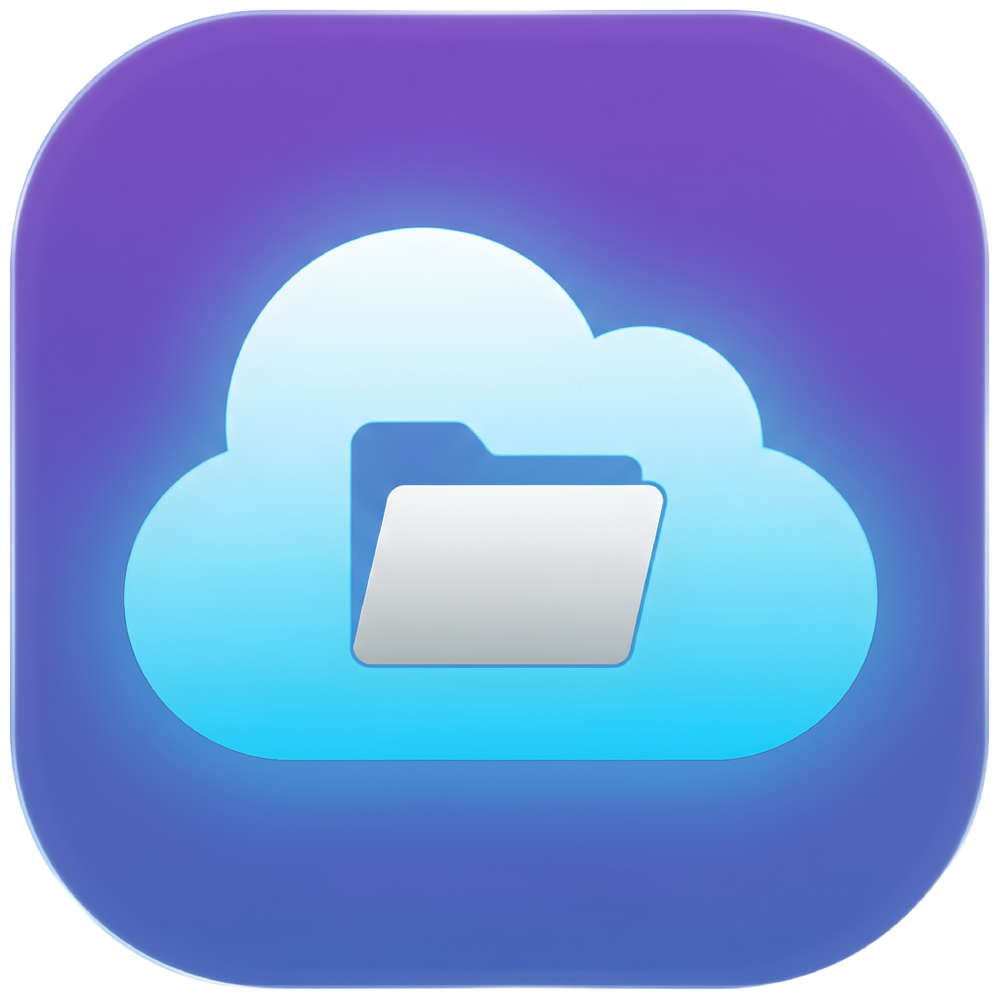

<div align="center">



# Growly S3 Browser

**A Modern, Multi-Platform Desktop Application for AWS S3 Management**

[](https://github.com/getgrowly/growly-s3-browser/releases)
[](LICENSE)
[](#installation)
[](https://github.com/getgrowly/growly-s3-browser)
[](https://getgrowly.github.io/growly-s3-browser)

[🌐 Website](https://getgrowly.github.io/growly-s3-browser) • [Features](#-features) • [Installation](#-installation) • [Screenshots](#-screenshots) • [Development](#-development) • [Contributing](#-contributing)

</div>

---

## 🌐 Live Demo & Documentation

**Visit our website:** [https://getgrowly.github.io/growly-s3-browser](https://getgrowly.github.io/growly-s3-browser)

Explore features, download the latest version, and access comprehensive documentation.

---

## 🚀 Features

### 🎨 Modern & Intuitive Interface
- **Material UI Design** - Beautiful, responsive interface built with Material UI v7.3
- **Dark/Light Mode** - Seamless theme switching for comfortable viewing
- **Multi-language Support** - Available in English and Turkish

### 📦 Comprehensive S3 Operations
- **Bucket Management** - Create, list, and delete S3 buckets effortlessly
- **File Operations** - Upload, download, delete, and preview files with ease
- **Virtualized Lists** - Handle thousands of files with smooth scrolling performance
- **File Preview** - Built-in preview for images, videos, audio, PDFs, and text files

### 🔐 Secure & Flexible
- **Multiple Configurations** - Manage multiple S3 accounts and switch between them instantly
- **AWS Signature V4** - Secure authentication with proper AWS signing
- **S3-Compatible Services** - Works with AWS S3, MinIO, DigitalOcean Spaces, and more
- **Signed URLs** - Generate secure, time-limited sharing links

### ⚡ Performance & Reliability
- **Download Manager** - Track and manage multiple downloads with progress indicators
- **Smart Notifications** - Real-time toast notifications for all operations
- **Auto-Updates** - Automatic version checking and seamless updates
- **Offline Support** - Local caching with SQLite database

### 🖥️ Multi-Platform Desktop App
- **macOS** - Native support for Intel and Apple Silicon (arm64)
- **Windows** - Available as NSIS installer, MSI, and portable executable
- **Linux** - Distributed as AppImage, .deb, and .rpm packages

---

## 📥 Installation

### 🌐 Quick Download

**Visit our website for easy downloads:** [https://getgrowly.github.io/growly-s3-browser](https://getgrowly.github.io/growly-s3-browser)

### Download Pre-built Binaries

Visit the [Releases Page](https://github.com/getgrowly/growly-s3-browser/releases) to download the latest version for your platform:

#### macOS
- **DMG Installer**: `Growly-S3-1.0.12-arm64.dmg` (Apple Silicon)
- **DMG Installer**: `Growly-S3-1.0.12-x64.dmg` (Intel)
- **ZIP Archive**: Also available for both architectures

> **⚠️ macOS First-Time Setup:**
>
> macOS Gatekeeper may show a warning since this app is not notarized by Apple.
>
> **Quick Fix (Method 1 - Recommended):**
> 1. Open the DMG file
> 2. Double-click **"Fix Gatekeeper.command"** script
> 3. Drag Growly S3 to Applications folder
> 4. Open the app - it will work! ✅
>
> **Manual Fix (Method 2):**
> ```bash
> xattr -cr "/Applications/Growly S3.app"
> ```
>
> **For Maintainers:** Want to eliminate this step? See [Apple Notarization Setup](.github/APPLE_NOTARIZATION_SETUP.md) guide (requires Apple Developer Program: $99/year).

#### Windows
- **NSIS Installer**: `Growly-S3-1.0.12-x64.exe` (Recommended)
- **MSI Installer**: `Growly-S3-1.0.12-x64.msi`
- **Portable**: `Growly-S3-1.0.12-x64.exe` (No installation required)

#### Linux
- **AppImage**: `Growly-S3-1.0.12-x86_64.AppImage` (Universal)
- **Debian/Ubuntu**: `Growly-S3-1.0.12-amd64.deb`
- **RedHat/Fedora**: `Growly-S3-1.0.12-x86_64.rpm`

---

## 🖼️ Screenshots

<div align="center">

### Dashboard View


### Bucket Management


### File Browser


### File Preview


</div>

---

## 🛠️ Development

### Prerequisites

- Node.js 18+ (recommended: 20+)
- npm or pnpm
- Git

### Tech Stack

- **Framework**: Next.js 15 with App Router
- **Desktop Runtime**: Electron 35
- **UI Library**: Material UI v7.3 + Radix UI
- **Language**: TypeScript
- **State Management**: Zustand + React Query
- **Database**: SQLite (better-sqlite3)
- **Styling**: Emotion + Tailwind CSS utilities

### Quick Start

1. **Clone the repository**
   ```bash
   git clone https://github.com/getgrowly/growly-s3-browser.git
   cd growly-s3-browser
   ```

2. **Install dependencies**
   ```bash
   yarn install
   ```

3. **Run development mode**
   ```bash
   yarn electron:dev
   ```

4. **Build for production**
   ```bash
   # Build for current platform
   yarn electron:build

   # Build for specific platform
   yarn electron:build:mac
   yarn electron:build:win
   yarn electron:build:linux

   # Build for all platforms
   yarn electron:build:all
   ```

### Project Structure

```
growly-s3-browser/
├── app/                    # Next.js app router pages
│   ├── api/               # API routes for S3 operations
│   ├── layout.tsx         # Root layout
│   └── page.tsx           # Main application page
├── components/            # React components
│   ├── ui/               # Reusable UI components
│   └── layout/           # Layout components
├── docs/                 # GitHub Pages website
│   ├── index.html        # Landing page
│   └── _config.yml       # Jekyll configuration
├── electron/             # Electron main process
│   └── src/
│       ├── main.ts       # Main process entry
│       ├── database.ts   # SQLite database
│       └── preload.ts    # Preload script
├── lib/                  # Core libraries
│   ├── s3-client.ts     # S3 client implementation
│   ├── api-client.ts    # API client wrapper
│   ├── database.ts      # Database abstraction
│   └── i18n/            # Internationalization
├── types/               # TypeScript type definitions
└── public/              # Static assets
```

### Available Scripts

```bash
yarn dev                 # Run Next.js dev server
yarn build               # Build Next.js app
yarn electron:dev        # Run Electron in development mode
yarn electron:build      # Build Electron app for current platform
yarn lint                # Run ESLint
yarn test                # Run tests
yarn format              # Format code with Prettier
```

---

## 🔧 Configuration

### Adding S3 Configuration

1. Click the **"Add Configuration"** button in the sidebar
2. Fill in your S3 credentials:
   - **Name**: Friendly name for this configuration
   - **Access Key ID**: Your AWS access key
   - **Secret Access Key**: Your AWS secret key
   - **Region**: AWS region (e.g., us-east-1)
   - **Endpoint** (Optional): Custom endpoint for S3-compatible services

### S3-Compatible Services

Growly S3 works with any S3-compatible service:

- **AWS S3** - Default, leave endpoint empty
- **MinIO** - Use your MinIO server endpoint
- **DigitalOcean Spaces** - `https://{region}.digitaloceanspaces.com`
- **Wasabi** - `https://s3.{region}.wasabisys.com`
- **Backblaze B2** - Compatible with S3 API

---

## 🤝 Contributing

Contributions are welcome! Please read our [Contributing Guide](CONTRIBUTING.md) for details on our code of conduct and the process for submitting pull requests.

### Development Workflow

1. Fork the repository
2. Create your feature branch (`git checkout -b feature/amazing-feature`)
3. Commit your changes following [Conventional Commits](docs/COMMIT_CONVENTION.md)
4. Push to the branch (`git push origin feature/amazing-feature`)
5. Open a Pull Request

### Commit Convention

We use [Conventional Commits](https://www.conventionalcommits.org/) for automated versioning:

- `feat:` - New features
- `fix:` - Bug fixes
- `docs:` - Documentation changes
- `chore:` - Maintenance tasks
- `refactor:` - Code refactoring
- `test:` - Test updates
- `perf:` - Performance improvements

---

## 📝 License

This project is licensed under the MIT License - see the [LICENSE](LICENSE) file for details.

---

## 🙏 Acknowledgments

- Built with [Electron](https://www.electronjs.org/) and [Next.js](https://nextjs.org/)
- UI powered by [Material UI](https://mui.com/) and [Radix UI](https://www.radix-ui.com/)
- Icons from [Lucide](https://lucide.dev/)

---

## 🔗 Links

- **🌐 Official Website**: [https://getgrowly.github.io/growly-s3-browser](https://getgrowly.github.io/growly-s3-browser)
- **📦 Releases**: [Download Latest Version](https://github.com/getgrowly/growly-s3-browser/releases)
- **🐛 Issues**: [Report a Bug](https://github.com/getgrowly/growly-s3-browser/issues)
- **💬 Discussions**: [Ask Questions](https://github.com/getgrowly/growly-s3-browser/discussions)
- **📖 Documentation**: [Visit Website](https://getgrowly.github.io/growly-s3-browser)

## 📧 Contact

- **Email**: open@getgrowly.co
- **GitHub**: [@getgrowly](https://github.com/getgrowly)
- **Author**: Growly Team

---

<div align="center">

**Made with ❤️ by the Growly Team**

[🌐 Visit Website](https://getgrowly.github.io/growly-s3-browser) • [⬆ Back to Top](#growly-s3-browser)

</div>

